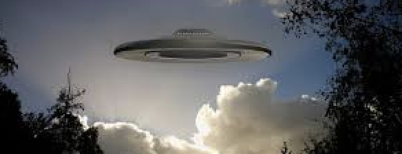
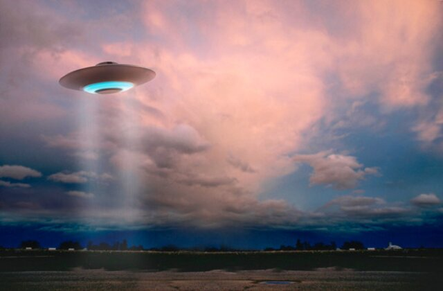
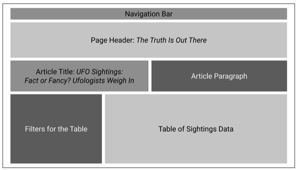
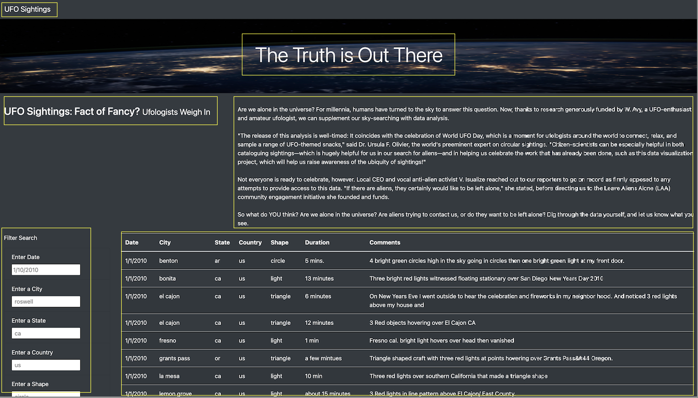
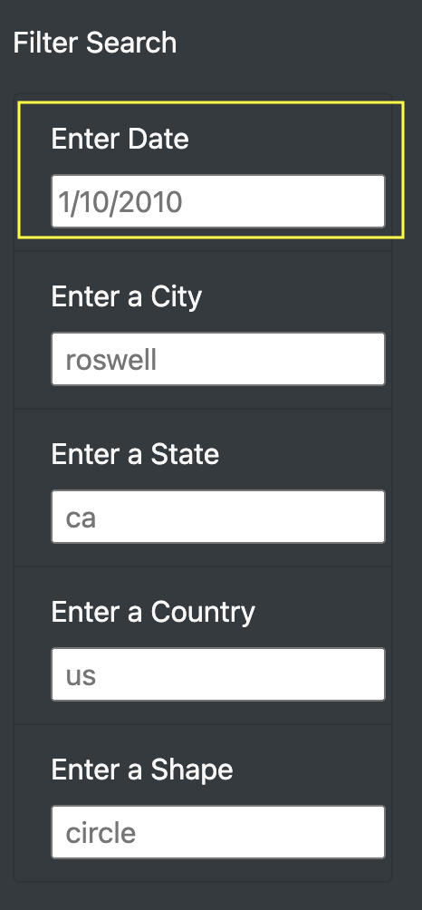
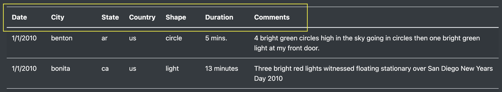
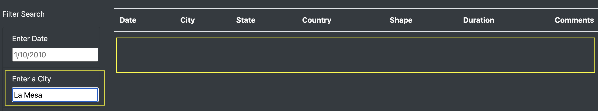
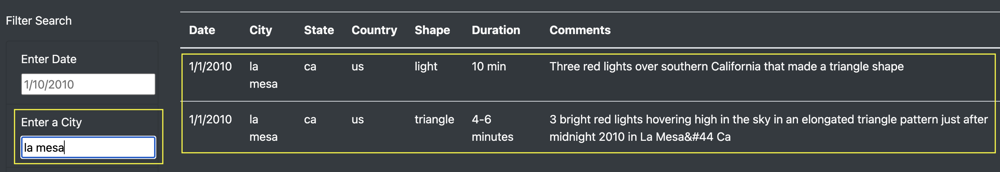

# UFO Sightings

## Overview

### Purpose

The purpose of this analysis is to help Dana, a data journalist, with her webpage of UFO sightings. Using JavaScript, a dynamic table was created allowing users to filter for multiple criteria at the same time. This includes filtering by date, city, state, country, and shape. 

Now, Dana's dynamic webpage can provide a more in-depth analysis of UFO sightings. 

<p float="left">
  
  
  
</p>

## Results

### Dataset and Files

* Data.js file: [data](static/js/data.js)
* App.js file: [app](static/js/app.js)
* Index.html file: [index](index.html)

### Software and Web-Based Application

* JavaScript, or JS
* HyperText Markup Language, or HTML
* Google Chrome
* Visual Studio Code - Version: 1.62.3

### Outcomes

The UFO Sightings dynamic webpage includes the following:

- Navigation Bar: "UFO Sightings"
- Page Header: "The Truth is Out There"
- Article Title: "UFO Sightings: Fact or Fancy? Ufologists Weigh In"
- Article Paragraph
- Filters for the Table: "Date, City, State, Country, and Shape"
- Table of UFO Sightings Data

<p float="left">
  
   
</p>

Furthermore, below is a quick walk-through on how to use the filters to search for specific data from the table of UFO sightings data. The filters for the table are located on the left side of the webpage. In this example, the user looks up for UFO sightings in the shape of a triangle and in the city of La Mesa, California. Once the user presses enter, the table gives an output of one row of data with complete details. 

https://user-images.githubusercontent.com/95309815/156206558-a978ceb5-cba0-4769-bd31-aaf126460bd9.mov

As shown here, there are placeholders for each filter to guide the user on how to write a search entry. For example, to enter a date the format to follow is month/day/year or 1/10/2020 as displayed.

<p float="left">
  
</p>

Lastly, the registered UFO sightings data is presented as a table organized by date, city, state, country, shape, duration, and comments.



## Summary

The UFO Sightings webpage has great features, however there is a drawback to it. In the filter's search bar, the data is case sensitive and does not allow for misspelling nor incomplete entries. This truly limits the filter search capability, therefore limiting the volume of data output. For example, one would enter La Mesa using upper case for both words as it is a city located in California. However, the city data is saved using lower case and as such, will not recognize the entry as shown below. 





With that stated, here are two recommendations or HTML attributes that could be used for further development:

```
- The <input> tag with the <autocomplete> tag can be added to provide automated assistance in filling out field values. 

- The <select> tag with the <option> tag can be added to create a drop-down list.
```

Both attributes can offer added value to the UFO Sightings webpage. For instance, under the filter search for shape, it is difficult to know what shapes to search for in the data table. At a quick glance, a user can see circle, triangle, and oval as possible shapes to look for in a search. Although, it would be challenging for a user to think of fireball, chevron or light as a possible shape in their search entry. By adding these HTML attributes, it can eliminate any confusion when searching for specific data and enhance the user experience.    

In summary, Dana's webpage of UFO sightings has now a dynamic table that allows users to filter for multiple criteria at the same time. These include date, city, state, country, and shape that can be filtered to provide a more in-depth analysis of UFO sightings.
